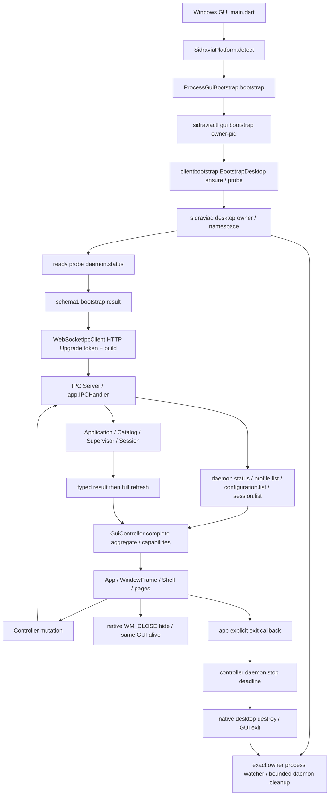

# R6 production IPC evidence (local scope complete)

Start HEAD: 97b796a5499c2fc88c1a9477439c664228710117. Origin verified live:
git@github.com:CaelestisAstesia/sidravia.git. Target branch and remote both97b796a.
main worktree retains unrelated uncommitted internal/cli changes. No push/PR.

## Production chain (source-backed)

`gui/lib/main.dart::main` validates SIDRAVIA_NAMESPACE, restores only namespace
GUI settings, initializes DesktopPresence, creates production GuiController.
`platform/sidravia_platform.dart::detect` selects ProcessGuiBootstrap on Windows.
`bootstrap/process_gui_bootstrap.dart::bootstrap` resolves same-directory
sidraviactl.exe and runs `gui bootstrap --owner-pid <GUI pid>`, inherits namespace.
`internal/cli/gui_bootstrap.go::guiBootstrap` calls
`clientbootstrap.BootstrapDesktop` and confirms version/build/PID/mode/owner.
`internal/clientbootstrap/bootstrap.go::bootstrapDesktop` calls ensure/probe;
`launcher_windows.go::launchDaemonProcessWith` starts same-directory sidraviad,
with explicit desktop owner and namespace. productlayout resolves isolated paths.
`cmd/sidraviad/runtime.go::constructProductionSystem/composeObjectGraphWithLaunchOptions`
owns catalog, environment, Supervisor, IPC host and exact desktopowner watcher.
Ready probe uses authoritative daemon.status before bootstrap emits schema1.
Dart decodeGuiBootstrap strictly validates loopback endpoint/token/build/desktop.
`WebSocketIpcClient.connect` HTTP Upgrade uses Bearer and Sidravia-Build-ID;
`internal/ipc/server/server.go::ServeHTTP` checks token/build. No separate JSON
handshake or `snapshot` method exists. `GuiController._refresh` serially requests
`daemon.status`, `profile.list`, `configuration.list`, `session.list`, then publishes
one complete GuiSnapshot. Poll timer is controller-owned; one client per generation.
App → WindowFrame → Shell → Home/Configuration/Settings/Advanced consumes it.

Mutation chain: client exact method → Server.serveConn → app.IPCHandler switch →
ConfigurationHandler/SessionHandler → Application → Catalog or Supervisor/Session →
typed result → client decoder → GuiController._runMutation → full _refresh.
Methods: configuration.create/update/setPassword/remove; session.startConfiguration/
stop/ensureRunning/restart/remove; daemon.stop. Optional update bool pointers preserve
false; Dart maps explicitly include false. Metadata update omits password/booleans
so existing values survive; empty displayName is allowed, null optional Session fields
are omitted by Go, not substituted by GUI.



## Exit owners

Native `gui/windows/runner/flutter_window.cpp::MessageHandler`, WM_CLOSE hides
window while keeping GUI/owner alive. RestoreWindow restores same GUI; namespace
single-instance mutex routes second launch to existing window. Tray exit invokes
`exitRequested` → `SidraviaApp._handleExitRequested` →
`GuiController.exitAndDisconnect` cancels polling, waits current transition and
submits daemon.stop once with deadline → DesktopPresence.destroy → native destroy
permits final window/process exit. Daemon runtime owns bounded shutdown; exact
Windows owner process watcher also shuts down daemon on GUI crash. Socket close
alone does not own daemon lifetime. No reconnect timer or persisted manual-disconnect
flag exists in GUI.

## Automation semantics

Catalog.Update persists AutoLogin/AutoReconnect via existing atomic store.
cmd/sidraviad runtime.deliverSnapshots evaluates Application.PerformAutomaticLogin
once per generation after initial environment snapshot. AuthenticationResolver.Resolve
copies autoReconnect into RuntimeDefinition; Session clones/fixes it at construction.
StartConfigurationAuthentication uses existing Session.EnsureRunning before resolving
new definition. Restart reuses frozen definition. Manual stop suspends intent, leaves
saved preferences unchanged. No policy redesign is required.

## Actual gaps fixed

The formal bootstrap and mutation plumbing already existed. R6 adds no duplicate
backend or mock production entry. The real client/controller flattened transport,
protocol and refresh failures into bootstrap_failed. They now retain fixed
ipc_connection_failed, ipc_handshake_failed, ipc_timeout, ipc_disconnected,
ipc_protocol_error and ipc_business_rejected diagnostics; business mutation guidance
and Session authentication errors remain separate. Diagnostics shows/copies IPC state,
code and safe message even before the first snapshot. No raw exception/token is shown.

The missing cross-layer evidence is now provided by SDK integration_test (dev only),
real daemon bootstrap beside the Windows runner, and a test-only native lifecycle
harness. Go, IPC wire protocol, authentication/storage/productlayout, reconnect state
machine, production main, OfflineDemoClient and native frame files are unchanged.

## Evidence layers and results

| Layer | Result | What it proves |
|---|---|---|
| Flutter unit/widget/offline regression | 275 passed | Existing offline behavior plus fixed diagnostics; not daemon E2E |
| Dart socket/protocol tests | passed in above suite | Exact true/false payload, malformed/unsupported typed result, real refused loopback socket and silent-server request timeout; synthetic protocol peer |
| Go native WSL tests | `go test ./...` passed | Domain, handlers, strict contracts, namespace, automatic login and frozen reconnect definitions; fake transports remain domain evidence |
| Windows production-main integration | passed | Calls unchanged production.main, default ProcessGuiBootstrap/real WebSocket/real daemon; real rendered username and settings switches |
| Windows Debug/Release build | passed | Native compilation; separate from process evidence |
| Windows main.dart Release executable | passed, two generations | Real desktop daemon/status/profile/config/session lists; second instance activation; GUI crash owner shutdown; GUI restart |
| Windows native lifecycle harness | passed | Calls production.main, existing native close channel, real poll afterward, second-instance restore, actual app explicit-exit callback and native destroy; both processes exited |
| Human Windows tray clicks/visual/DPI acceptance | not performed | Computer Use failed initialization with sandboxCwd localURI; no screenshot or human click claim |
| Campus authentication | not performed | No real account/password, production credentials or campus server access |

Production-main integration final events and sanitized PIDs are in
`D:/Tools/Sidravia/validation/r6-20261006/evidence/production-integration.log`.
Release smoke JSON records GUI34656→daemon35204 and GUI37488→daemon3332;
version0.1.0-dev/builddev reflects actual freshly built development processes,
not a tagged release claim. Native exit JSON records GUI44780/daemon47868,
GUIexit0, daemonExited=true, unchanged namespace sentinels.

### Mutation round-trip

| Method | Real Windows result |
|---|---|
| configuration.create | generated ID, stored fictional credential, protected storage; controller snapshot and Home username matched |
| configuration.update metadata | username changed; omitted password/preference fields preserved |
| configuration.setPassword | fictional replacement acknowledged, stored flag retained |
| configuration.update autoLogin | actual Settings switch true then false, real snapshot refreshed |
| configuration.update autoReconnect | actual Settings switch false then true; later false persisted across restart |
| configuration.remove | returned success, list empty, create capability restored |
| session.startConfiguration | actual retained Session with configuration ID and maintain_authentication intent |
| session.stop | suspended intent/state; saved auto preferences unchanged |
| session.ensureRunning | same retained Session resumed |
| session.restart | same Session ID, existing definition retained |
| session.remove | record absent after refresh |

Session tests target only127.0.0.1:59998, with system_assigned local UDP port.
They prove Session lifecycle and local IPC, **not successful authentication**.
No test changes real network adapters or the user's production connection.

### Failure/recovery matrix

| Case | Evidence |
|---|---|
| ctl executable missing | Actual ProcessGuiBootstrap OS launch failure, safe bootstrap_failed |
| daemon executable missing | Actual ctl child-start failure, safe bootstrap_failed |
| daemon starts but cannot become ready | Actual daemon with temporarily malformed owned Profile exits before readiness; GUI stale with safe bootstrap failure; original bytes restored |
| WebSocket connect refused | Actual loopback TCP refusal in socket test, ipc_connection_failed |
| handshake/protocol rejection | Actual daemon401 wrong token and409 wrong build, ipc_handshake_failed |
| request timeout | Silent local protocol peer and real Dart request timeout; no actual daemon deliberately stalled |
| malformed/unsupported response | Strict protocol/result tests with synthetic peer; not reported as real daemon behavior |
| business rejection | Actual profile_not_found, fixed GUI guidance, connection remains ready |
| capability rejection | Wrong configuration target rejected locally; no mutation of saved autoLogin |
| daemon stops in operation | Actual daemon.stop, old snapshot retained stale, ipc_disconnected |
| mutation succeeds but refresh fails | Test-only observer forwards all accessed methods to real WebSocket client, stops real daemon after acknowledged update and before refresh; controller returns false/stale and retains old snapshot; retry reads committed value |
| daemon restart | Actual new PID, persisted configurations/preferences, fresh empty Session generation |
| GUI restart / crash | Release owner process stopped by exact launched Process object; actual daemon watcher exits and runtime removed; next GUI generation boots independently |
| close / reopen / explicit exit | Native-channel test described above, daemon identity retained through close/restore; app callback stops daemon then native destroy exitsGUI0 |

The pure startup_unconfirmed timeout classification remains bootstrap contract
evidence; no claim that a live daemon was forced into every ambiguous readiness timing.
Polling is serial and publishes whole four-query aggregates; observed poll retained
ready and PID. No server connection-count telemetry was added; single connector/
in-flight behavior is additionally covered by existing controller/client tests.

## Isolation, commands and cleanup

Namespace mechanism is existing SIDRAVIA_NAMESPACE, never an empty/production alias.
Owned portable paths:

- `.../gui/build/windows/x64/runner/Debug/namespaces/r6-local-20261006`
- `.../gui/build/windows/x64/runner/Release/namespaces/r6-release-20261006-r3`
- `.../gui/build/windows/x64/runner/Release/namespaces/r6-exit-20261006`

Profiles/configurations/runtime/logs/settings are confined there. Program-directory
production-shaped sentinels (`config/configurations.json`, `config/gui-settings.json`,
`runtime/runtime.json`) in the **owned test bundle** stayed byte-identical. No user
production file was opened to obtain that proof. Compiled candidate source hashes and
binary hashes are retained in the evidence directory; build copies/caches are excluded
from Git. Tests remove their namespace after typed stop/owner-exit conditions. Windows
sharing violation32 on final log release has a bounded20s condition wait; other errors
are propagated. Stop/cleanup deadlines are explicit; no blind startup sleep.

Commands executed from the target worktree:

```bash
python3 .project/tooling/agent-workflow/boundary_probe.py
python3 .project/tooling/agent-workflow/validate_plan.py .project/execution/active-plan.md
python3 .project/tooling/agent-workflow/agent_check.py
GOCACHE=/home/astesia/.cache/go-build /home/astesia/.local/opt/go1.26.4/bin/go test ./...
GOOS=windows GOARCH=amd64 GOCACHE=/home/astesia/.cache/go-build /home/astesia/.local/opt/go1.26.4/bin/go build -o <owned-root>/sidraviactl.exe ./cmd/sidravia
GOOS=windows GOARCH=amd64 GOCACHE=/home/astesia/.cache/go-build /home/astesia/.local/opt/go1.26.4/bin/go build -o <owned-root>/sidraviad.exe ./cmd/sidraviad
# gui/
flutter pub get
dart format <exact R6 Dart scope>
flutter analyze
flutter test
```

Native Windows runner (PowerShell5, standard PATHEXT set only for this process and
restored in finally; no global/user environment edits):

```powershell
powershell.exe -NoProfile -ExecutionPolicy Bypass -File D:\Tools\Sidravia\validation\r6-20261006\gui\tool\r6_windows_ipc.ps1 -OwnedRoot D:\Tools\Sidravia\validation\r6-20261006
# Partial reruns select only the relevant stage:
# -Stage Integration / Smoke / Exit
```

The script invokes Flutter3.47.0 Windows via cmd.exe:
`pub get`, `build windows --debug -t lib/main.dart`,
`test integration_test/r6_production_test.dart -d windows`,
`build windows --release -t lib/main.dart`, and separately
`build windows --release -t tool/r6_exit_smoke.dart` for test-only exit evidence.
The production Release bundle is preserved under `.../production-release` before
building the lifecycle harness; the harness is never labeled the shipped main entry.
Reruns refuse pre-existing namespace state. This is a test/evidence workspace, not an
installer, a release package, or an invitation to launch without its namespace.

Three incident-backed Recovery transitions preserved the outgoing plan and exact
dirty bytes: mechanical analyzer correction limit, inherited PATHEXT=.CPL, and smoke
finally masking an original PowerShell result/cleanup error. Remaining allowed
harness corrections fixed actual binary nameSidravia.exe, .NET VoidTaskResult output
contamination, and sharing-violation cleanup. All had scoped fixes and were followed
by relevant reruns; original native integration failures are not counted as PASS.
No protected code was altered as a workaround.

## Stop boundary and next field acceptance

Local real IPC scope stops here. Campus authentication remains a separate authorized
human run: confirm candidate hash and Windows namespace, get explicit consent to use
real credentials/campus endpoint, then observe authenticating→authenticated, manual
stop and intended autoReconnect behavior with safe cleanup. No automatic campus run,
production credential read, push, merge, PR, installer or release is authorized.
Human tray mouse clicks and visual acceptance remain separate from the native-channel
lifecycle evidence above. WSL is only Go/unit evidence, never substituted for Windows.

## Git boundary
One semantic R6 commit from97b796a; exact ending HEAD is recorded after commit in
`D:/Tools/Sidravia/validation/r6-20261006/evidence/R6-HEAD.json` and final delivery.
No remote state changes. Main worktree unrelated edits remain preserved.
